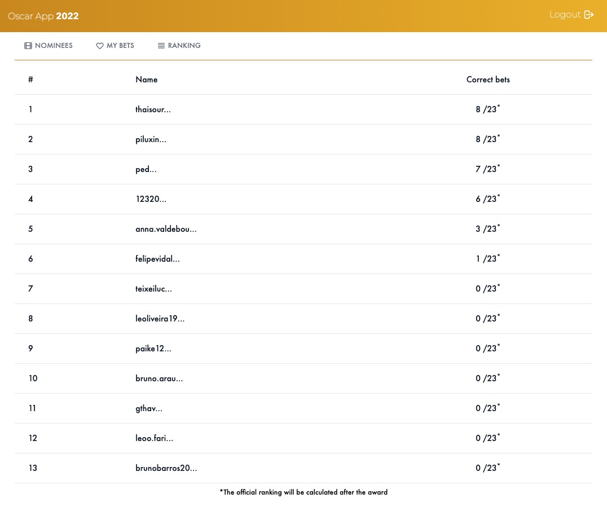

## To run it 

Please add your credentials (or hardcoded on dev.exs and prod.exs) from Google API (Oauth) and a postgres database 

# Frontend Dependencies
```bash
npm install 
```

# With Elixir (standalone)
```bash
# Migrate and start the project
mix deps.get
mix ecto.create
mix ecto.migrate
iex -S phx.server

# To run tailwind css
npm run tailwind
```

# With docker
- Copy the makefile.example to makefile
- Update the values on makefile (google auth and postgres)
- Execute `make run`

The project will be available on `http://localhost:4000`


# Pages

## Nominees


## Bets


## Ranking
